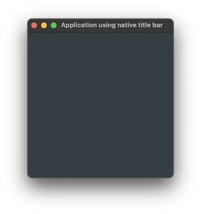

# ApplicationUsingNativeTitleBar

Shows how to create a simple JUCE application with [juce::JUCEApplication](https://docs.juce.com/master/classJUCEApplication.html) class and [juce::TopLevelWindow::setUsingNativeTitleBar](https://docs.juce.com/master/classTopLevelWindow.html#a749fbd5e688ed8c9af3d0d99b21e18c8) method.

## Source

* [src/ApplicationUsingNativeTitleBar.cpp](src/ApplicationUsingNativeTitleBar.cpp)
* [CMakeLists.txt](CMakeLists.txt)

## Output



## Build and run

To build this project, open "Terminal" and type following lines:

### Windows :

``` shell
mkdir build && cd build
cmake .. 
start ApplicationUsingNativeTitleBar.sln
```

Select `ApplicationUsingNativeTitleBar` project and type Ctrl+F5 to build and run it.

### macOS :

``` shell
mkdir build && cd build
cmake .. -G "Xcode"
open ./ApplicationUsingNativeTitleBar.xcodeproj
```

Select `ApplicationUsingNativeTitleBar` project and type Cmd+R to build and run it.

### Linux with Code::Blocks :

``` shell
mkdir build && cd build
cmake .. -G "CodeBlocks - Unix Makefiles"
xdg-open ./ApplicationUsingNativeTitleBar.cbp > /dev/null 2>&1
```

Select `ApplicationUsingNativeTitleBar` project and type F9 to build and run it.

### Linux :

``` shell
mkdir build && cd build
cmake .. 
cmake --build . --config Debug
./ApplicationUsingNativeTitleBar
```
