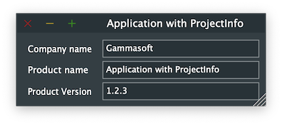

# ApplicationWithProjectInfo

Shows how to create a simple JUCE application with [juce::JUCEApplication](https://docs.juce.com/master/classJUCEApplication.html) class, [juce::Label](https://docs.juce.com/master/classLabel.html) and [juce::TextEditor](https://docs.juce.com/master/classTextEditor.html) widgets and how to use ProjectInfo..

## Source

* [src/ApplicationWithProjectInfo.cpp](src/ApplicationWithProjectInfo.cpp)
* [CMakeLists.txt](CMakeLists.txt)

## Output



## Build and run

To build this project, open "Terminal" and type following lines:

### Windows :

``` shell
mkdir build && cd build
cmake .. 
start ApplicationWithProjectInfo.sln
```

Select `ApplicationWithProjectInfo` project and type Ctrl+F5 to build and run it.

### macOS :

``` shell
mkdir build && cd build
cmake .. -G "Xcode"
open ./ApplicationWithProjectInfo.xcodeproj
```

Select `ApplicationWithProjectInfo` project and type Cmd+R to build and run it.

### Linux with Code::Blocks :

``` shell
mkdir build && cd build
cmake .. -G "CodeBlocks - Unix Makefiles"
xdg-open ./ApplicationWithProjectInfo.cbp > /dev/null 2>&1
```

Select `ApplicationWithProjectInfo` project and type F9 to build and run it.

### Linux :

``` shell
mkdir build && cd build
cmake .. 
cmake --build . --config Debug
./ApplicationWithProjectInfo
```
