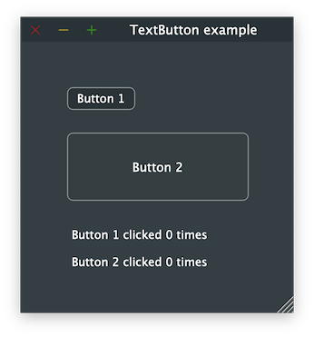

# TextButton

Shows how to create a TextButton widget with [juce::TextButton](https://docs.juce.com/master/classTextButton.html) widgets.

## Source

* [src/TextButton.cpp](src/TextButton.cpp)
* [CMakeLists.txt](CMakeLists.txt)

## Output



## Build and run

To build this project, open "Terminal" and type following lines:

### Windows :

``` shell
mkdir build && cd build
cmake .. 
start TextButton.sln
```

Select `TextButton` project and type Ctrl+F5 to build and run it.

### macOS :

``` shell
mkdir build && cd build
cmake .. -G "Xcode"
open ./TextButton.xcodeproj
```

Select `TextButton` project and type Cmd+R to build and run it.

### Linux with Code::Blocks :

``` shell
mkdir build && cd build
cmake .. -G "CodeBlocks - Unix Makefiles"
xdg-open ./TextButton.cbp > /dev/null 2>&1
```

Select `TextButton` project and type F9 to build and run it.

### Linux :

``` shell
mkdir build && cd build
cmake .. 
cmake --build . --config Debug
./TextButton
```
