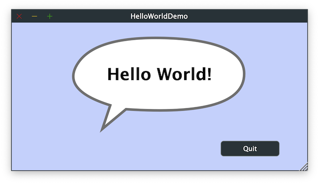

# HelloWorldJUCE

The classic first application HelloWorld with [juce::Label](https://docs.juce.com/master/classLabel.html) and [juce::TextButton](https://docs.juce.com/master/classTextButton.html) widgets and [juce::Path](https://docs.juce.com/master/classPath.html) class.

## Source

[src/HelloWorldJUCE.cpp](src/HelloWorldJUCE.cpp)

[CMakeLists.txt](CMakeLists.txt)

## Output



## Build and run

To build this project, open "Terminal" and type following lines:

### Windows :

``` shell
mkdir build && cd build
cmake .. 
start HelloWorldJUCE.sln
```

Select `HelloWorldJUCE` project and type Ctrl+F5 to build and run it.

### macOS :

``` shell
mkdir build && cd build
cmake .. -G "Xcode"
open ./HelloWorldJUCE.xcodeproj
```

Select `HelloWorldJUCE` project and type Cmd+R to build and run it.

### Linux with Code::Blocks :

``` shell
mkdir build && cd build
cmake .. -G "CodeBlocks - Unix Makefiles"
xdg-open ./HelloWorldJUCE.cbp > /dev/null 2>&1
```

Select `HelloWorldJUCE` project and type F9 to build and run it.

### Linux :

``` shell
mkdir build && cd build
cmake .. 
cmake --build . --config Debug
./HelloWorldJUCE
```
