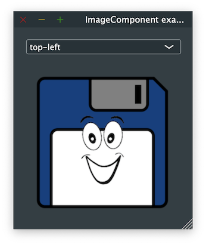

# ImageComponent

Shows how to create a Image widget with [juce::ImageComponent](https://docs.juce.com/master/classImageComponent.html).

## Source

* [src/ImageComponent.cpp](src/ImageComponent.cpp)
* [resources/logo.png](resources/logo.png)
* [CMakeLists.txt](CMakeLists.txt)

## Output



## Build and run

To build this project, open "Terminal" and type following lines:

### Windows :

``` shell
mkdir build && cd build
cmake .. 
start ImageComponent.sln
```

Select `ImageComponent` project and type Ctrl+F5 to build and run it.

### macOS :

``` shell
mkdir build && cd build
cmake .. -G "Xcode"
open ./ImageComponent.xcodeproj
```

Select `ImageComponent` project and type Cmd+R to build and run it.

### Linux with Code::Blocks :

``` shell
mkdir build && cd build
cmake .. -G "CodeBlocks - Unix Makefiles"
xdg-open ./ImageComponent.cbp > /dev/null 2>&1
```

Select `ImageComponent` project and type F9 to build and run it.

### Linux :

``` shell
mkdir build && cd build
cmake .. 
cmake --build . --config Debug
./ImageComponent
```
